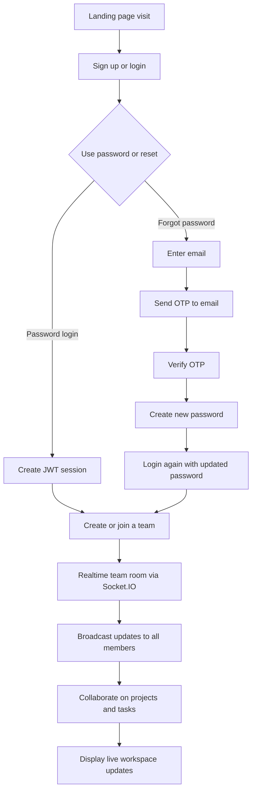

# DesignSpace

DesignSpace is a real-time collaborative team platform for shared workspaces, team formation, and live project coordination. The system combines secure authentication, realtime collaboration, and team-based workflow management.

## Tech stack

- Frontend: React + Vite
- Backend: Node.js + Express
- Real-time layer: Socket.IO
- Auth: Email/password + OTP flow
- Deployment target: Azure App Service
- Conflict resolution model: Last-Write-Wins (LWW)

## Core features

- Signup and login using email/password
- Forgot password flow with email OTP verification
- Password reset using verified OTP and new password assignment
- Team creation and team joining flows
- Real-time collaborative updates in team rooms
- Event-driven live state sync across users
- Shared project, task, and workspace coordination

## Mermaid workflow



## Project structure

- frontend/: React app and landing screens
- backend/: Express API and realtime server
- README.md: project overview and workflow

## Local setup

Frontend:

```bash
cd frontend
npm install
npm run dev
```

Backend:

```bash
cd backend
npm install
npm run dev
```

## Production configuration

Set these environment variables before deploying:

### Backend (.env)

```env
NODE_ENV=production
PORT=4000
JWT_SECRET=replace-with-a-long-random-secret
CORS_ORIGIN=https://your-frontend-domain.com
SMTP_PROVIDER=gmail
SMTP_HOST=smtp.gmail.com
SMTP_PORT=587
SMTP_USER=your-email@gmail.com
SMTP_PASS=your-16-character-app-password
MAIL_FROM=your-email@gmail.com
DB_PATH=./data/designspace.db
```

### Frontend

```env
VITE_API_URL=https://your-backend-domain.com
```

## Production notes

- Never use hardcoded local host URLs in production builds.
- The frontend reads the API URL from `VITE_API_URL`.
- The backend will reject unsafe default SMTP credentials in production.
- Use a verified email provider and strong secrets for real deployments.

## Notes

This repository is structured to support a phased MVP workflow:

1. Backend-first implementation and tests
2. Frontend draft and app shell
3. Production polish and deployment setup
