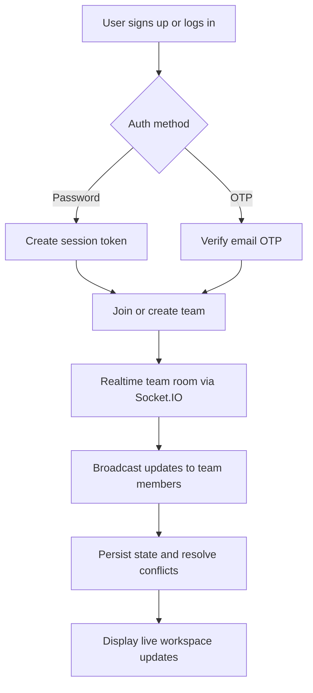

# DesignSpace

DesignSpace is a real-time collaborative team platform for shared workspaces, team formation, and live project coordination. The system combines secure authentication, real-time collaboration, and team-based workflow management.

## Tech stack

- Frontend: React + Vite
- Backend: Node.js + Express
- Real-time layer: Socket.IO
- Auth: Email/password + OTP flow
- Deployment target: Azure App Service
- Realtime collaboration model: Last-Write-Wins (LWW) conflict handling

## Core features

- User signup and login with email/password
- Email OTP verification flow for auth
- Team creation and joining workflows
- Real-time collaborative updates across team rooms
- Event-driven state sync for multi-user actions
- Conflict resolution strategy for concurrent edits

## Workflow

## Project structure

- frontend: React landing page and app shell
- backend: Express API + Socket.IO service
- auth: password and OTP authentication flows
- teams: collaborative team room logic

## Notes

This repository is structured to support phased development:

1. Backend-first implementation and tests
2. Frontend UI and collaboration screens
3. Final integration and production polish
