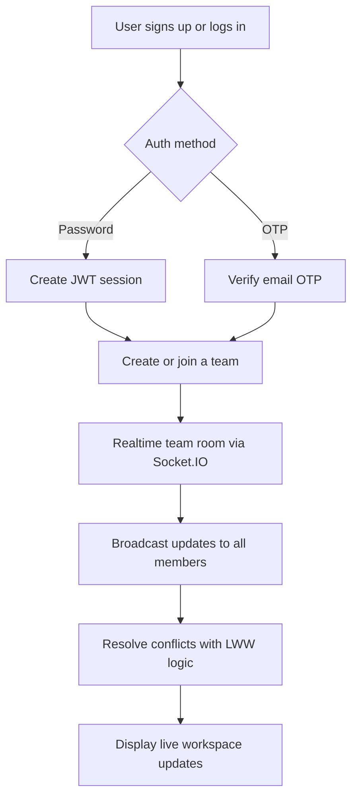

# DesignSpace

DesignSpace is a real-time collaborative team platform for shared workspaces, team formation, and live project coordination. The system combines secure authentication, realtime collaboration, and team-based workflow management.

## Tech stack

- Frontend: React + Vite
- Backend: Node.js + Express
- Real-time layer: Socket.IO
- Auth: Email/password + OTP flow
- Deployment target: Azure App Service
- Conflict resolution model: Last-Write-Wins (LWW)

## Core features

- Signup and login using email/password
- Email OTP verification for authentication
- Team creation and team joining flows
- Real-time collaborative updates in team rooms
- Event-driven live state sync across users
- Conflict handling for concurrent edits

## Mermaid workflow



## Project structure

- frontend/: React app and landing screens
- backend/: Express API and realtime server
- README.md: project overview and workflow

## Local setup

Frontend:

```bash
cd frontend
npm install
npm run dev
```

Backend:

```bash
cd backend
npm install
npm run dev
```

## Notes

This repository is structured to support a phased MVP workflow:

1. Backend-first implementation and tests
2. Frontend draft and app shell
3. Production polish and deployment setup
