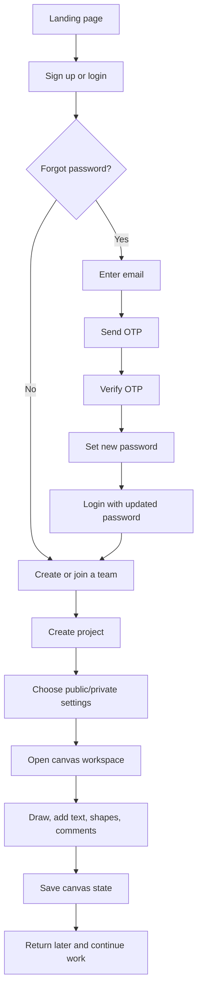

# DesignSpace

DesignSpace is a collaborative product workspace created for teams to organize projects, manage members, and design together in a single streamlined dashboard. It brings together secure authentication, project coordination, reusable design assets, and a real-time collaborative canvas in one modern interface.

## Why this project

DesignSpace is built to help teams move faster from ideas to execution by combining planning, collaboration, and visual design in a single environment. The platform is ideal for:

- creating structured team workspaces with project-based organization
- collaborating on concepts, layouts, and UI ideas in real time
- capturing feedback directly on the board without leaving the workflow
- keeping work organized across sessions and product iterations
- presenting a polished, demo-ready workflow for modern product teams

## Tech stack

- Frontend: React + Vite
- Backend: Node.js + Express
- Realtime layer: Socket.IO
- Authentication: email/password login + OTP-based forgot-password flow
- Storage: browser-based persistence for project and canvas state during prototyping
- Design: responsive dashboard layout with a dark-mode workspace aesthetic

## Core features

- Landing page with promotional content, templates, testimonials, and CTA sections
- Sign up, login, and password reset flows
- Email OTP verification for account recovery and reset workflows
- Team and project creation with private and public project settings
- Shared canvas environment for drawing, text, shapes, and comments
- On-canvas text editing, resizing, and styling controls
- Comment panel with open/close and resizable behavior
- Saved board state so drawings and edits remain available after refresh or revisits
- Auto-save behavior for project data and canvas updates in the browser
- Responsive layout for desktop, tablet, and mobile experiences

## Project workflow



## Screenshots

### Landing page


### Team dashboard


### Collaborative canvas workspace


## Project structure

- frontend/: React app and UI screens
- backend/: Express API, auth endpoints, and realtime server
- docs/screenshots/: demo screenshots for the project overview
- README.md: project overview and run instructions

## Run the project

Open two terminals and run the following commands.

### 1) Frontend

```bash
cd frontend
npm install
npm run dev
```

The frontend should run on:

```text
http://localhost:5177
```

### 2) Backend

```bash
cd backend
npm install
npm run dev
```

The backend should run on:

```text
http://localhost:4000
```

### Quick full setup

```bash
cd frontend && npm install && npm run dev
```

In a second terminal:

```bash
cd backend && npm install && npm run dev
```

## Project notes

- This project is positioned as a polished product prototype for a collaborative design platform, making it well suited for validation, iteration, and stakeholder demos.
- The app uses browser-based persistence to keep project and canvas state available across sessions, helping present a smooth, complete user experience.
- The OTP-based reset flow is intentionally lightweight for demo and development use while keeping the architecture ready for secure production deployment and email integration.
- The solution is designed to scale naturally from a prototype into a cloud-backed, multi-user product with strong collaboration capabilities.
- Git identity verification update: this commit is being created using the global email configuration for project publishing and collaboration.

## Recommended next roadmap

1. Move from browser-based persistence to a production database for scalable multi-user storage and project history
2. Add secure cloud deployment, environment-based configuration, and a robust email or SMS verification provider
3. Expand collaboration with version history, permission controls, and real-time team workflows
4. Introduce advanced product features such as reusable templates, team analytics, and workflow automation for larger organizations
5. Position the platform as a modern design collaboration tool for product teams, agencies, and startup environments
