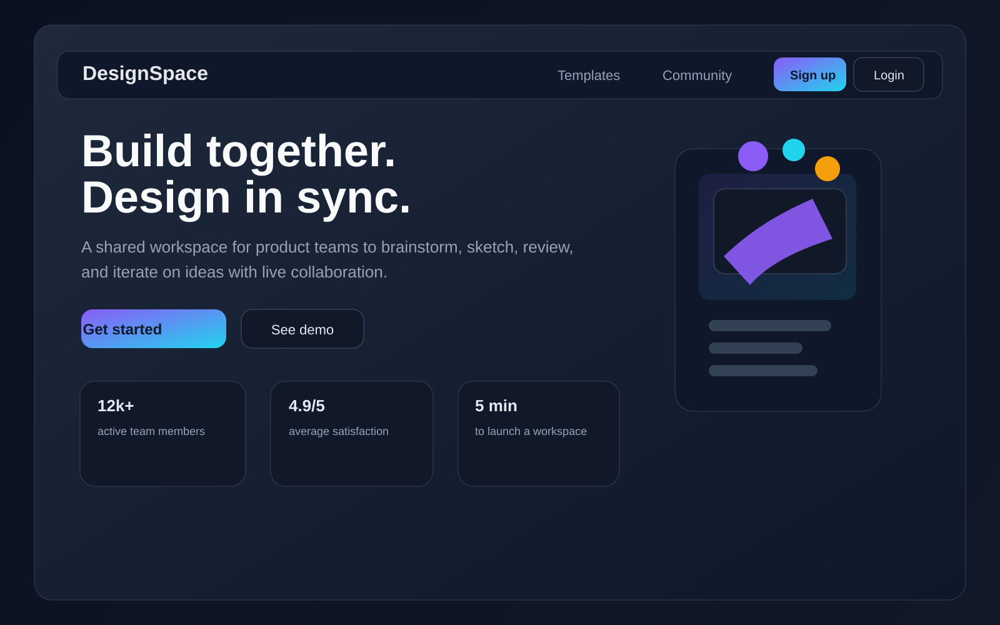
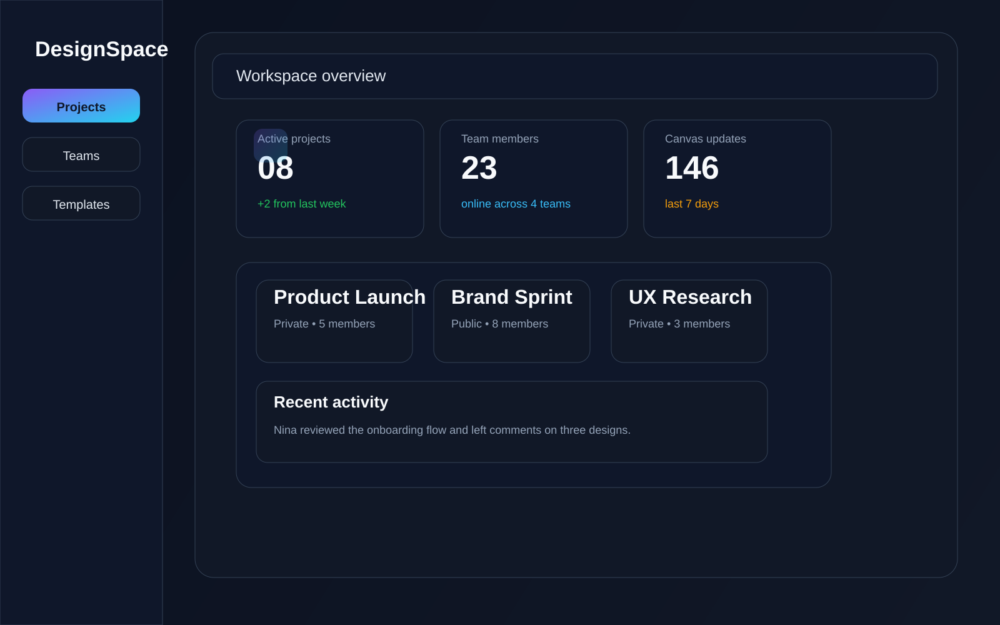
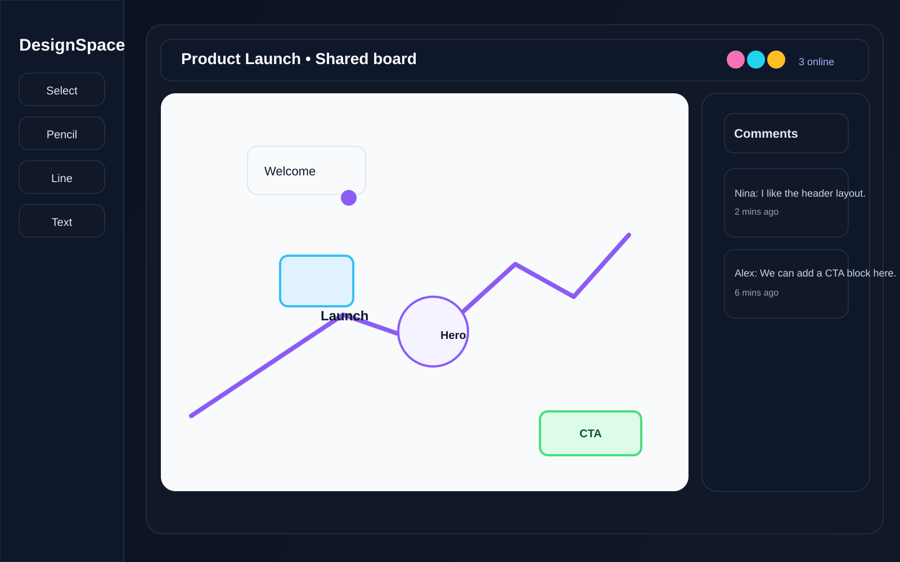

# DesignSpace

DesignSpace is a local-first collaborative workspace for teams to create projects, manage members, and work together on live design boards. It combines secure auth, project management, reusable design templates, and a real-time canvas experience in one dashboard.

## Why this project

This app is designed for small teams that want to:

- create a shared workspace with project-based organization
- collaborate on visual ideas and layouts in real time
- leave comments and feedback directly on the board
- persist designs locally so work stays available after reloads or returning sessions
- preview a modern product workflow without needing a full hosted production setup yet

## Tech stack

- Frontend: React + Vite
- Backend: Node.js + Express
- Realtime layer: Socket.IO
- Authentication: email/password login + OTP-based forgot-password flow
- Storage: browser localStorage for project and canvas persistence during local use
- Design: responsive dashboard layout with dark mode workspace styling

## Core features

- Landing page with promotional content, templates, testimonials, and CTA sections
- Sign up, login, and password reset flows
- Email OTP verification for forgot-password and reset flow
- Team and project creation with private/public project settings
- Shared canvas workspace for drawing, text, shapes, and comments
- On-canvas text editing, resize support, and style controls
- Comment panel with open/close and resizable behavior
- Persisted board state so drawings and edits remain after refresh or return login
- Responsive layout for desktop, tablet, and mobile use

## Project workflow

```mermaid
flowchart LR
    A[Landing page] --> B[Login or signup]
    B --> C[Create or join a team]
    C --> D[Create a project]
    D --> E[Choose project privacy]
    E --> F[Open collaborative canvas]
    F --> G[Draw / add text / add shapes]
    G --> H[Leave comments and review feedback]
    H --> I[Save board state locally]
    I --> J[Return later and continue from saved work]
```



## Screenshots

### Landing page



### Team dashboard



### Collaborative canvas workspace



## Project structure

- frontend/: React app and UI screens
- backend/: Express API, auth endpoints, and realtime server
- docs/screenshots/: demo screenshots for the project overview
- README.md: project overview and run instructions

## Run locally

Open two terminals and run the following commands.

### 1) Frontend

```bash
cd frontend
npm install
npm run dev
```

The frontend should run on:

```text
http://localhost:5177
```

### 2) Backend

```bash
cd backend
npm install
npm run dev
```

The backend should run on:

```text
http://localhost:4000
```

### Quick full setup

```bash
cd frontend && npm install && npm run dev
```

In a second terminal:

```bash
cd backend && npm install && npm run dev
```

## Notes

- This project is currently intended for local development and demo use.
- The app persists project and canvas state in the browser using localStorage.
- The OTP flow is local-only and designed for demo use before a production email provider is configured.
- Real production deployment should be done only after adding a secure domain, environment variables, and a production-grade email service.

## Recommended next steps

1. Add a deployed backend with a real database and SMTP provider
2. Replace browser localStorage with a server-backed database for multi-user persistence
3. Add production auth rules, environment validation, and deployment pipeline
4. Expand collaboration with real-time object locking and multi-user cursor syncing
